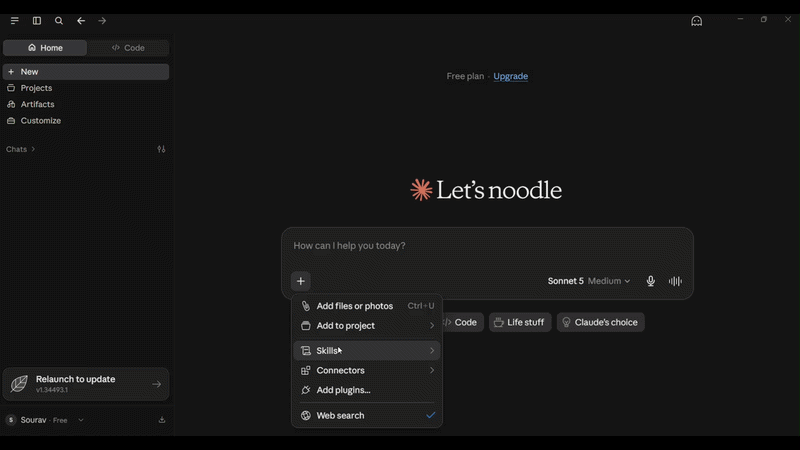

# Calculator MCP Server

A small [Model Context Protocol (MCP)](https://modelcontextprotocol.io/) server that exposes basic calculator operations over stdio.



## Features

The server provides these tools:

| Tool  | Description                                | Arguments    |
| ----- | ------------------------------------------ | ------------ |
| `add` | Adds two numbers                           | `op1`, `op2` |
| `sub` | Subtracts the second number from the first | `op1`, `op2` |
| `mul` | Multiplies two numbers                     | `op1`, `op2` |
| `div` | Divides the first number by the second     | `op1`, `op2` |

All arguments must be numbers. `div` returns an error when `op2` is `0`.

## Requirements

- Node.js 18 or later
- npm

## Setup

Install the dependencies from this directory:

```bash
npm install
```

## Run the server

Start the MCP server over stdio:

```bash
npm start
```

The server waits for an MCP client to connect, so it does not print normal application output to the terminal.

## Test with the example client

The example client starts the server, lists its tools, and calls `div` with `10` and `0` to demonstrate the division-by-zero error:

```bash
npm run test-client
```

To test a successful operation, update the `callTool` arguments in `mcp-client-test.ts`, for example:

```ts
arguments: { op1: 10, op2: 2 },
```

## Use MCP Inspector

Run the interactive MCP Inspector with:

```bash
npm run mcp-inspect
```

Open the URL printed by the command, then select a calculator tool and provide values for `op1` and `op2`.

## Project files

- `mcp-server.ts` - MCP server and calculator tool definitions
- `mcp-client-test.ts` - example MCP client
- `mcp-calculator.gif` - tutorial walkthrough
- `package.json` - scripts and dependencies
